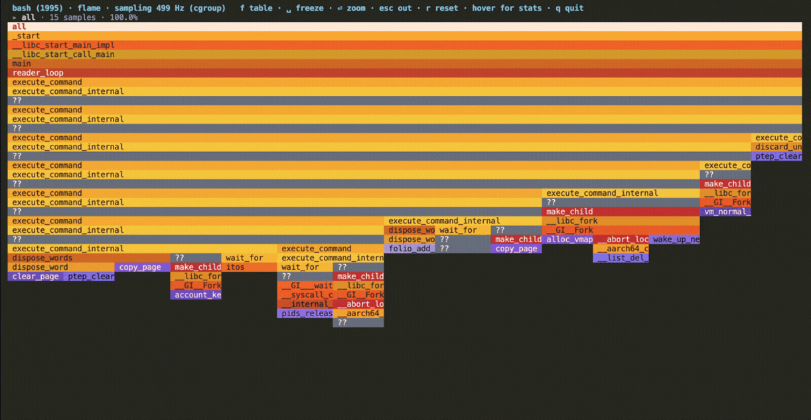

# `hotspot`

> **Click a process. See which function is eating the core.**

<p align="center">
  <a href="#requirements"></a>
  <a href="https://yeet.cx/docs/?utm_source=github&utm_medium=readme&utm_campaign=hotspot&utm_content=badge"></a>
  <a href="#the-bpf-side"></a>
  <a href="#how-it-works"></a>
  <a href="#license"></a>
  <a href="https://discord.gg/JxVseaAVAU"></a>
</p>

<p align="center">
  
</p>

**`hotspot` is an eBPF sampling CPU profiler for Linux: pick a process out of a live table, click it, and watch a flat self-time profile build in real time with user and kernel frames side by side.**

It samples where the CPU actually was, so a function that shows up hot is hot because the instruction pointer kept landing in it, not because a counter said so. User and kernel frames arrive on the same footing: a process stuck in `__arch_clear_user` reads exactly like one stuck in its own hot loop, which is what tells you whether the problem is your code or the syscall it keeps making.

The thing you would otherwise reach for is `perf record` followed by `perf report`, or a language-specific profiler like `py-spy` or `async-profiler`. `perf` means installing `linux-tools` matched to the running kernel, capturing to a file, then post-processing it, and a language profiler only sees one runtime. `hotspot` needs no matching package, no capture file and no post-processing step, and it profiles whatever the process is written in because it reads the instruction pointer rather than a runtime's own introspection.

> [!TIP]
> **No `perf` install, no capture file, no post-processing.** `hotspot` arms a `perf_event` BPF program at 499 Hz per CPU scoped to the process's cgroup, and symbolizes each sampled address through the live process maps daemon-side. Nothing is written to disk, and the profile is on screen while the process is still running.

## Questions this tool answers

**One process is pinning a core and I need to know which function, right now.**
`yeet run . --tty`, click the process, and read the top of the table. Rows are self-time only, sorted hottest first, so the top row is where the CPU actually is rather than a caller that merely contains it. The first rows land in about a second at the default 499 Hz. See [What you're looking at](#what-youre-looking-at).

**I'm SSHed into a box where I can't install `perf` and there's no matching `linux-tools` package. Can I still profile?**
Yes, and this is the case the shape is for. `perf` needs a `linux-tools` build matched to the running kernel, which is exactly what a minimal or slightly-behind image doesn't have. `hotspot` needs the yeet daemon and this script; the sampler is a CO-RE BPF program, so there's no per-kernel recompile and nothing to match. It draws in the terminal you're already in, so there's also no port to forward.

**Is the time going into my code or into the kernel?**
That's the split the profile is built around. Each sample records the interrupted program counter, and PCs divide on the sign bit: kernel addresses resolve through kallsyms, user addresses through the process maps. Kernel rows are tinted and labeled `kernel`, so a syscall-bound process is visually obvious. `dd if=/dev/zero of=/dev/null` shows `__arch_clear_user` on top with `el0_svc` and `vfs_read` trailing; a busy interpreter shows its own eval loop instead.

**The hot work is on a worker thread, not the main thread. Will I see it?**
Yes. The sampler attaches to the process's **cgroup** rather than to a single pid, so worker pools, thread pools and runtime helper threads are all covered; attaching per-thread would race thread churn and miss anything spawned after you looked. An in-kernel `target_pid` filter keeps cgroup siblings out, so you get the whole process and only that process.

**I want a flame graph but I don't want to generate an SVG and open a browser.**
Press `f`. The flame view is an icicle graph rendered in the terminal, folded from the same samples, with hover tooltips showing inclusive samples, self time, fan-out and stack depth for the frame under the cursor. `⏎` zooms into a subtree, `esc` backs out. Press `t` instead for a timeline where the x-axis is wall-clock time, which is the view that shows a workload changing phase. See [Navigation](#navigation).

**Everything says `??` instead of function names. What's wrong?**
Usually nothing is broken; the symbols genuinely aren't there. A `??` row means the PC landed somewhere the symbol tables don't name: between exported symbols in a stripped distro library (glibc's `_int_malloc`, IFUNC `memcpy` variants), or in a JIT region with no perf map. Installing the debug package (`apt install libc6-dbg`) names the first kind, because the resolver reaches past `.dynsym` into build-id debug files. A row that shows `??` with a spinner is still in flight rather than unresolved.

**Can I jump from a hot row to the source line on GitHub?**
Yes, when the binary carries DWARF. Run with `--repo org/repo` and each row's function name becomes an OSC 8 hyperlink to its hottest line, not the declaration. `o` copies the link to your clipboard through the terminal. `--rev` picks the branch or SHA and `--strip` bridges a build path that doesn't match the repo tree. See [Linking rows to GitHub](#linking-rows-to-github).

**Does sampling a process slow it down?**
The sampler fires 499 times a second per CPU and each tick writes one record: the interrupted PC plus up to 48 stack frames. The frequency is fixed and does not scale with how busy the process is, so the cost is bounded by CPU count rather than by workload. 499 is prime deliberately, so sampling never phase-locks with kernel ticks (100/250/300/1000 Hz) or round application timers, which would otherwise bias the profile toward whatever happens to run at those phases.

**Is this a replacement for Datadog Profiler, Pyroscope, or Parca?**
No. `hotspot` is one process on one host, live, with no retention, no history and no fleet view. Close it and the profile is gone; there's no continuous profiling, no comparison between deploys, and no flame graph you can link a colleague to. It's for the ten minutes where you need to know what a specific process is doing right now, which is when a continuous profiler's aggregated view is least specific. Run both.

**When should I use this instead of `perf top`, `py-spy`, or a language profiler?**
Reach for `hotspot` when you want to point at a process and get a live user-plus-kernel profile without installing anything matched to the kernel. Reach for `perf` when you need call-graph recording to a file, hardware PMU events (cache misses, branch mispredicts), or the enormous surrounding toolchain; `hotspot` samples `cpu_clock` only. Reach for `py-spy`, `async-profiler` or an equivalent when you need interpreter-level or JIT-aware frames: those tools understand a runtime's own stack representation, and a native sampler shows you the interpreter's C frames instead. For memory rather than CPU, that's a different question entirely.

**Can I run this in CI, or have an agent read the output?**
Not directly. `hotspot` is a mouse-driven TUI with no headless mode and no `--json`. See [Reading it without a TTY](#reading-it-without-a-tty) for what's actually available and what it would take to add.

## Contents

**Run it** — [Quick start](#quick-start) · [Have an agent set it up](#have-an-agent-set-it-up) · [Without a TTY](#reading-it-without-a-tty) · [Demo workloads](#try-it-without-a-real-workload)

**Understand it** — [Questions this tool answers](#questions-this-tool-answers) · [A 60-second primer](#a-60-second-primer-on-sampling-profilers) · [What you're looking at](#what-youre-looking-at) · [How it works](#how-it-works) · [What it can't see](#what-it-cant-see)

**Reference** — [Navigation](#navigation) · [Linking rows to GitHub](#linking-rows-to-github) · [Requirements](#requirements) · [FAQ](#faq) · [License](#license)

**Contribute** — [Building from source](#building-from-source) · [Testing across kernels](#testing-across-kernels)

## Quick start

```sh
curl -fsSL https://yeet.cx | sh
make              # compile bin/probe.bpf.o + bundle the JS (toolchain auto-fetched)
yeet run . --tty  # the live process table; click a process to profile it
```
[Manual install guide](https://yeet.cx/docs/install/manual-installation?utm_source=github&utm_medium=readme&utm_campaign=hotspot) | Linux only

With no flags you land on the process table: every process with an executable, sorted by name. Kernel threads are filtered out because they have no `exe` and no user stacks. Click a row to select it, click the selected row (or `⏎`) to start profiling, and the pane becomes a live profile. No sampling happens until you open a process.

Script flags go **after `--`** so the runtime routes them to the script rather than consuming them itself, which is the most common first-run mistake. Note that `--tty` is a flag to `yeet run` itself and therefore goes *before* the `--`.

| flag | default | meaning |
| --- | --- | --- |
| `--freq=<hz>` | `499` | sampling frequency per CPU. Lower it on a many-core box if the ring buffer can't keep up; raise it for faster convergence on a short-lived hot spot. Prime values avoid phase-locking with kernel ticks |
| `--repo=<org/repo>` | off | turn function names into GitHub links. Also accepts a full URL |
| `--rev=<sha\|branch>` | `main` | the revision those links point at |
| `--strip=<prefix>` | none | strip a build-machine path prefix from DWARF paths to make them repo-relative |

```sh
yeet run . --tty -- --freq 997                        # sample harder
yeet run . --tty -- --repo torvalds/linux --rev v6.12 # link kernel rows to a tag
yeet run . --tty -- --repo me/svc --strip /build/src/ # bridge a container build path
```

Runs until `q` or `Ctrl-C`. Resize the terminal and every view reflows. It needs a real terminal and mouse reporting, so don't pipe or redirect it.

## Have an agent set it up

Paste this into Claude Code or any agent with shell access:

```
Clone https://github.com/yeet-src/hotspot and work in it.
Read AGENTS.md first, then:

1. Install yeet if it isn't present: curl -fsSL https://yeet.cx | sh
2. Run `make` and confirm bin/probe.bpf.o was produced.
3. Build and start a demo workload, which is what gives the profiler
   something to show on an idle box:
     make demo
     ./demo/cafe &
4. Run: yeet run . --tty
5. Navigate to the `cafe` process with the arrow keys and press Enter.
   Confirm that within a few seconds you see rows with real function names
   (toil, grind_beans, steam_milk, tamp_layer) and non-zero sample counts.
6. Press `f` for the flame view and confirm blocks appear, then `q` to quit.

"It compiled" is not the same as "it works". An empty profile and a broken
profile look identical, which is why steps 3 and 5 are not optional. If the
table stays empty, the sampler either didn't load or didn't attach; the
status line in the header says which.

Trap: this needs a kernel with BTF (CONFIG_DEBUG_INFO_BTF=y) and perf_event
BPF support. The BPF load fails at step 5, not at step 2, so a clean `make`
tells you nothing about whether it will run. A second trap: rows showing
`??` instead of names is usually missing debug symbols in the target, not a
bug — which is why step 5 profiles the demo workload (built -O0 -g) rather
than a random system process.
```

Prefer to drive it yourself? [Quick start](#quick-start) is three lines.

## A 60-second primer on sampling profilers

The mental model for what `hotspot` measures, and what that does and doesn't tell you:

**Sampling, not tracing.** Nothing is instrumented and no function entry is counted. A timer interrupts each CPU 499 times a second, and whatever the CPU was executing at that instant gets recorded. A function that holds 30% of the samples was on-CPU for roughly 30% of the sampled time. This is statistical: rare functions may be missed entirely, and small differences between rows aren't meaningful until the sample count is large.

**Self time, not total time.** The flat table counts only the **leaf**, the function the CPU was actually inside. A function that calls expensive things but does little itself will barely appear in the flat view even though its subtree dominates. That's the right default for "which code is burning the core" and the wrong one for "which call path is responsible". The flame view (`f`) is the second question: there a block's width is its *inclusive* share, subtree included.

**On-CPU only.** A sampling profiler sees a process when it's running. Time spent blocked (waiting on I/O, a lock, or the scheduler) produces no samples at all, because the CPU is off doing something else. A process that's slow because it's waiting will look nearly idle here, which is the limit everything in [What it can't see](#what-it-cant-see) follows from.

**Addresses, then names.** The kernel ships raw program counters; naming them is a separate step against symbol tables. That's why names can lag a moment behind counts, and why a stripped binary yields `??`: the sample is real, the name just isn't recoverable.

## What you're looking at

Two screens. The process table:

```
 hotspot · 214 processes   click/⏎ profile · r refresh · q quit
    1041  cafe             /home/dev/hotspot/demo/cafe
     892  containerd       /usr/bin/containerd
    1518  node             /usr/lib/node_modules/.bin/node
     734  postgres         /usr/lib/postgresql/16/bin/postgres
       1  systemd          /usr/lib/systemd/systemd
```

Then the flat profile, once you open one:

```
 cafe (1041) · sampling 499 Hz (cgroup)   ←/esc back · f flame · t stream · q quit
   %              samples  ● function     · 4,812 samples · 63 pcs symbolized
  31.4% ██████████████    1511  ● toil
  18.2% ████████           876  ● steam_milk
  12.7% █████▌             611  ● knead_dough
   9.1% ████               438  ● grind_beans
   6.3% ██▊                303  ● tamp_layer
   4.8% ██▏                231  ● __arch_clear_user            kernel
   2.1% ▉                  101  ● ??
 ● cafe  ● libc.so.6  ● kernel
```

The **header** carries the target, the sampler's state (`arming sampler…`, `sampling 499 Hz (cgroup)`, or a probe error), and the keys for this view. The **status line** repeats the column layout and the running totals: cumulative samples and how many distinct PCs have been named so far. The **table** is one row per function, self-time only, hottest first. The **legend row** at the bottom keys the colored dots to the object each function lives in.

| column | meaning |
| --- | --- |
| `%` | this function's share of all samples taken so far, colored by heat: green below 25% of the peak row, amber to 66%, red above |
| bar | the same share drawn against the hottest row, so the top row's bar is always full |
| `samples` | raw sample count for this function, cumulative since you opened the process |
| `●` | which object the function lives in, keyed by the legend row. Purple always means kernel |
| `function` | the demangled symbol, syntax-highlighted per identifier span and never truncated (the row clips at the screen edge instead). A trailing spinner means the name is still being resolved; `??` means it couldn't be |

Colors are 24-bit RGB throughout, and the flame and stream views assume a truecolor terminal. Function names paint as OSC 8 hyperlinks when `--repo` is set.

## Navigation

The process table:

| key | action |
| --- | --- |
| click | select the row under the pointer |
| click again, `→`, `l`, or `⏎` | start profiling the selected process |
| `↑` `↓` / `k` `j` / wheel | move the selection |
| `PgUp` `PgDn` / `g` `G` | page, or jump to the ends |
| `r` | reload the process table |
| `q` | quit |

The flat profile:

| key | action |
| --- | --- |
| `←`, `h`, `esc`, or right-click | back to the process table, stopping the sampler |
| `↑` `↓` / `k` `j` / wheel / `PgUp` `PgDn` / `g` `G` | move and scroll the row selection |
| `f` | the flame view |
| `t` | the stream view |
| `o` | copy the selected row's GitHub link (needs `--repo`) |
| `q` | quit |

The **flame view** (`f`) is an icicle graph: root on top, each row a depth, each block sized by its share of its parent, hottest branch leftmost. Blocks are colored from a warm ramp keyed by a hash of the function name, so the same function is the same color everywhere; kernel frames get the purple family. Self time shows up as the unfilled gap under a parent.

| key | action |
| --- | --- |
| `h` `j` `k` `l` or arrows | walk siblings, descend into the hottest overlapping child, or climb to the parent |
| click | select the block under the pointer |
| hover | a tooltip with the full breakdown: inclusive samples and share of both the current view and the whole capture, self time, fan-out, stack depth, source line, and a histogram of where the frame's samples go |
| `⏎` | zoom into the selected subtree, which becomes the new root |
| `esc` | un-zoom, or leave for the flat table if not zoomed |
| `r` | reset the selection and the zoom |
| `␣` | freeze, which pauses the refold so you can read a moving graph |
| `o` | copy the selected block's GitHub link |

The **stream view** (`t`) is a live flame chart where x is time: one column per 400ms publish window, newest at the right edge, sliding left as windows land. Each column shows that window's dominant stack, and adjacent columns whose frame matches merge into one bar, so steady outer frames read as long bars while the leaf flickers. Idle windows leave real gaps, so a process that stopped working shows a hole rather than a stretched bar. `␣` freezes it, `f` and `t`/`esc` switch views.

## Linking rows to GitHub

When the target binary carries DWARF, each row knows the `file:line` of its **hottest** PC, meaning the hottest line inside the function rather than its declaration. Pass `--repo` and those become clickable links:

```sh
yeet run . --tty -- --repo me/service --rev deploy-2026-08-01
```

Function names then paint as OSC 8 hyperlinks (ctrl or cmd-click in most terminals), and `o` copies the selected row's URL to your clipboard via OSC 52.

The wrinkle is that DWARF records where the binary was **built**, not where the repo lives. A build run from the repo root records relative paths and needs nothing further. A build in a container or a CI workspace records something like `/build/src/main.c`, which is where `--strip=/build/src/` comes in: it removes that prefix so the remainder is repo-relative. A path that can't be made repo-relative yields no link rather than a wrong one.

Both hyperlinks and clipboard copy depend on the terminal honoring OSC 8 and OSC 52. When a copy is swallowed the header still flashes `link copied`, so a silent clipboard means the terminal declined, not that the tool failed.

## Reading it without a TTY

There isn't a headless mode, and this is the honest boundary: `hotspot` is a mouse-driven TUI whose entire interaction model is picking a process and switching views. There is no `--json`, no one-shot mode, and no `import.meta.main` self-test on the probe module, so unlike most yeet scripts there's no `yeet run src/probes/profile.js` shortcut to verify the pipeline as text.

For an agent or a CI job, the closest thing available today is `make veristat`, which confirms the sampler loads on this kernel and passes the verifier. That's a real answer to "will this work here" and no answer at all to "what is the process doing".

If you want a text profile, `src/probes/profile.js` is where to add it: `attachProfile()` already exposes `hot` (a Map of PC to count), `stacks`, `total` and `status` as plain signals, so a headless entry is a matter of sampling for N seconds, resolving through `createResolver()` from `src/lib/symbolize.js`, and printing the sorted rows. That's a genuinely small addition and a reasonable first contribution.

## How it works

The project follows the standard yeet-script layout: `src/probes/` is the only BPF-aware code and exposes plain signals, `src/lib/` is pure helpers, and `src/main.jsx` owns the views and input. They reference each other through the `@/` source alias.

```
src/bpf/sample.bpf.c    the perf_event sampler: interrupted PC + user stack → ringbuf
src/probes/profile.js   sampler lifecycle, cgroup scoping, folds samples into signals
src/lib/symbolize.js    kernel + process symbolization, cached and batched
src/lib/flame.js        stack folding, icicle layout, frame colors
src/lib/symhl.js        syntax highlighting for demangled symbol names
src/lib/github.js       DWARF path → GitHub blob URL, OSC 52 clipboard
src/main.jsx            the three views, keyboard and mouse input, rendering
bin/probe.bpf.o         the linked BPF object (built by `make`)
demo/                   synthetic CPU workloads with shaped call graphs
```

### The BPF side

One program, armed on demand rather than at startup:

| program | hook | what it captures |
| --- | --- | --- |
| `on_sample` | `perf_event` (`cpu_clock`, 499 Hz per CPU) | the interrupted program counter plus up to 48 user stack frames |

The interesting part is the scoping. The event is attached to the target's **cgroup v2 path**, resolved from the process graph, which means every task in that cgroup fires it: worker threads, thread pools and anything spawned after you started looking. Attaching per-thread would miss those and would race thread churn. Because a cgroup can hold siblings you didn't ask for, a `volatile int target_pid` global in `.bss` is patched from JS before the subscription opens, and the program drops any task whose tgid doesn't match. So the scope is "the whole process, all threads, and nothing else", enforced in-kernel before a record is reserved. When no cgroup can be resolved, it falls back to a pid-targeted attach.

Each tick reserves one `stack_sample` record on a `RINGBUF` (1 MiB) and fills it with `PT_REGS_IP()`, the PC the tick interrupted, plus `bpf_get_stack(..., BPF_F_USER_STACK)` for the user call stack. The PC is the load-bearing field: it's a **kernel** address when the tick landed in kernel mode and a **user** address otherwise, which is the whole basis of the user/kernel split upstairs. A sample with neither a PC nor a stack is discarded rather than submitted.

The kernel does no aggregation, no symbolization and no filtering beyond the pid check. That's deliberate: a sampler's kernel side should be as close to "copy a register and walk the frame pointers" as possible, because everything else can be done in userspace where it can't wedge a tick.

### The JS side

| file | responsibility |
| --- | --- |
| `src/probes/profile.js` | resolves the cgroup, loads and attaches the BPF object, patches `target_pid`, subscribes, and folds samples into `hot` / `stacks` / `history` / `total` / `status` signals published on a 400ms window |
| `src/lib/symbolize.js` | PC to function name, split on the sign bit, cached and batched through `symbolizeMany` |
| `src/lib/flame.js` | folds leaf-first stacks into a root-first trie, lays it out over the terminal columns, assigns frame colors |
| `src/lib/symhl.js` | tokenizes a demangled C++ or Rust symbol into spans so identifiers can be colored separately from punctuation |
| `src/lib/github.js` | DWARF `{dir, file, line}` to a GitHub blob URL, plus a hand-rolled base64 OSC 52 clipboard escape |
| `src/main.jsx` | the flat, flame and stream views, keyboard and mouse handling, the hover tooltip |

Symbolization is the part with the most care in it. Addresses cross the wire as `BigInt`, because a kernel PC exceeds 2^53 and would silently lose its low bits as a double. Kernel PCs resolve through `Inspector.kernel()` (kallsyms, which covers the core kernel, modules and JITed BPF); user PCs through `Inspector.process(pid, { debugSyms: true })`, which routes each address through the live process maps daemon-side so ASLR, deleted binaries, the vDSO and perf-map JIT symbols are all handled. `debugSyms` is what reaches past `.dynsym` into build-id debug files, which is the difference between `??` and `_int_malloc` on a stripped distro libc.

`resolve()` never blocks: it answers from a cache, and an unknown PC comes back as a pending `??` row while being queued. One `symbolizeMany` batch per side flushes per publish tick, so a profile with thousands of distinct PCs costs one round trip per 400ms rather than one per sample. ARM mapping symbols (`$x`, `$d`, `$t`) are filtered out, because a debug symtab will happily offer one as the containing "symbol" and they are ELF ABI markers rather than functions.

The three views are three foldings of the same sample stream. The flat table aggregates leaf PCs by resolved function. The flame view folds whole stacks into a trie, merging by resolved symbol rather than by address, so every call site of a function collapses into one box per branch. The stream view keeps a bounded history of 512 per-window buckets and renders each window's dominant stack as a column. Freezing (`␣`) stops the refold rather than the sampler, so the counts keep climbing behind a still image.

### Why a perf_event sampler, not `perf record` or a uprobe

A `perf_event` BPF program and `perf record` sit at the same kernel hook; the difference is everything around it. `perf record` writes samples to a file for a separate tool to post-process, which is the right shape for an archive and the wrong one for a question you're asking right now. Sampling into a ring buffer and folding in userspace puts the profile on screen while the process runs, and lets the same stream feed three different views without recapturing.

Instrumentation-based alternatives cost more and see less. A uprobe on every function of interest requires knowing which functions to instrument, which is the thing you're trying to find out, and it perturbs the program in proportion to how often those functions are called. Sampling's cost is fixed at 499 ticks per CPU per second regardless of what the program does, which is why the profile of a hot loop and the profile of an idle process cost the same.

The trade is honest: sampling is statistical and cannot tell you a function was called exactly 12,000 times. It tells you where the CPU was, which is the question that matters when a core is pinned.

## Building from source

```sh
make           # build bin/probe.bpf.o (clang + bpftool) + bundle the JS (esbuild)
make bpf       # just the BPF object
make bundle    # just the JS bundle (src/main.jsx → src/index.jsx)
make demo      # build the demo workloads in demo/ with the host compiler
make veristat  # load the object on this kernel and report verifier verdicts
make clean     # remove build artifacts
```

`make` runs two independent compilers. **clang and bpftool** compile every `src/bpf/*.bpf.c` and link them into one loadable object at `bin/probe.bpf.o`. **esbuild** bundles `src/main.jsx` into `src/index.jsx`, resolving the `@/` alias and leaving `yeet:*` builtins external. The toolchain is fetched into a per-machine cache on first build, so no system C or BPF toolchain is required and neither is Node or npm. The generated CO-RE header `src/bpf/include/vmlinux.h`, `bin/`, `src/index.jsx` and the compiled `demo/` binaries are gitignored build artifacts.

`make demo` is the exception that does use a host compiler: the demo workloads are ordinary userspace C programs, unrelated to the BPF object, and they need `gcc` or `clang` on `PATH`.

`#/` (project root) and `@/` (source root) are **bundle-time aliases** that esbuild resolves via `tsconfig` `paths`. The runtime resolver does not know them, which is why the BPF object is located with `import.meta.dirname` in `probes/profile.js`. This surprises everyone exactly once.

## Testing across kernels

A BPF program that loads on your laptop can be rejected by an older kernel's verifier, and the failure arrives at load time on someone else's machine. `make veristat` loads `bin/probe.bpf.o` with veristat on **your** kernel and reports whether every program passes, plus per-program instruction and state counts. Loading programs needs privileges, so this one does take `sudo`.

`.github/workflows/kernel-matrix.yml` runs the same check across 6.1, 6.6, 6.12 and `bpf-next` on every push and pull request, booting each kernel under QEMU and pivoting the results into one grid. `make veristat-matrix` runs it locally on Linux with KVM; pass `KERNELS="6.6 bpf-next"` to narrow it.

## Try it without a real workload

An idle box makes a boring profiler. `demo/` holds two synthetic CPU burners whose call graphs are shaped to give each view something to show:

```sh
make demo
./demo/cafe &        # or ./demo/patterns
yeet run . --tty     # click `cafe` in the process list
```

`cafe` simulates a café rotating through three shifts every four seconds, each burning CPU in its own call subtree, with a twelve-frame recursive tower in the espresso machine. It's the better single take: three distinct subtrees in flame mode and four-second bands sliding past in stream mode.

`patterns` draws shapes out of stack depth: a sine wave, a sawtooth staircase, and a self-similar binary cascade. It's built for stream mode, where a row's length is time spent at that depth or deeper.

Both compile `-O0 -g -fno-omit-frame-pointer`, which is load-bearing twice over: the stack walk follows frame pointers, and un-inlined functions are what keep their names on screen. `-g` is also what puts `file:line` on each row, so they're the easiest way to exercise `--repo` linking.

There's no capture script; [`demo/README.md`](demo/README.md) has the recording recipe, including the tour order and terminal size that read best in a GIF.

## Requirements

> [!IMPORTANT]
> Linux with **BTF** (`CONFIG_DEBUG_INFO_BTF=y`), needed to generate `vmlinux.h` and for the CO-RE relocations in the sampler. Default on current Arch, Fedora, Ubuntu, and Debian 12+. CO-RE means no per-kernel recompile.
>
> A kernel with **`perf_event` BPF program support and `bpf_get_stack`** (4.9 and 4.18 respectively; anything with BTF is far past both), plus **cgroup v2** for cgroup-scoped attach. Without cgroup v2 it falls back to pid-scoped sampling and misses worker threads.
>
> The yeet daemon handles the privileged BPF load; `curl -fsSL https://yeet.cx | sh` installs it. `yeet run` itself is unprivileged and never needs `sudo`.
>
> A truecolor terminal with mouse reporting. The click-to-profile and hover-tooltip interactions need mouse support; the keyboard covers everything except hover.

## What it can't see

> [!NOTE]
> `hotspot` is observability, not enforcement. It tells you where a process spent CPU; it does not stop, throttle, or change anything.

- **On-CPU time only.** A blocked process produces no samples. Time waiting on I/O, a lock, a futex or the scheduler is invisible, so a process that's slow because it's waiting looks idle. Off-CPU profiling needs scheduler tracepoints rather than a sampling timer, which is a different tool.
- **Self time in the flat view, inclusive only in the flame view.** The table counts leaves, so a caller whose subtree dominates can be nearly absent from it. Press `f` before concluding a function is cheap.
- **User stacks need frame pointers.** `bpf_get_stack` walks frame pointers, so a binary built with `-fomit-frame-pointer` (common at `-O2` on some toolchains) yields shallow or empty stacks. The flat view still works, because it needs only the interrupted PC, but the flame and stream views will be flat or truncated. There's no DWARF or ORC unwinding here.
- **Stacks are capped at 48 frames**, so a deeply recursive program is truncated at the root end rather than the leaf.
- **No interpreter or JIT frames.** A Python, Ruby or Node process shows the interpreter's native C functions (`vm_exec_core`, `_PyEval_EvalFrameDefault`), not your functions. JIT regions resolve only when the runtime writes a perf map. For language-level frames use `py-spy`, `async-profiler` or the equivalent for that runtime.
- **`??` rows are real samples with unrecoverable names**, most often PCs between exported symbols in a stripped library. `apt install libc6-dbg` and its equivalents fix the common case; a fully stripped binary with no build-id debug file cannot be named at all.
- **Kernel stacks are not walked**, only the interrupted kernel PC is recorded. So you learn which kernel function was executing, but not the call path that reached it. `bpf_get_stack` is called with `BPF_F_USER_STACK` only.
- **No hardware PMU events.** Sampling is on `cpu_clock` software events, so cache misses, branch mispredicts and instruction counts are out of scope. That's `perf`.
- **One process at a time, no history, nothing on disk.** Switching processes discards the profile, and so does quitting. There's no capture file to keep, no comparison between runs, and no fleet view.
- Sampling is statistical. Small differences between adjacent rows aren't meaningful, and a function that runs rarely may never be sampled.

## FAQ

**Why is the top row `??` with a spinner that never resolves?**
A spinner means queued, and a spinner that persists means the batch failed rather than that it's slow. The status line shows `sym: <error>` when symbolization errored; the most common cause is the process exiting while being profiled, since the resolver reads its live maps. Reopen the process.

**Why does the sample count keep climbing after I press space to freeze?**
`␣` freezes the *view*, not the sampler. The flame refold and the stream scroll stop so you can read a moving graph, while samples keep accumulating behind it. Unfreeze and the graph jumps to the current state.

**Why do I see functions from a process I didn't select?**
You shouldn't, and this is what the in-kernel `target_pid` filter prevents. Cgroup-scoped events fire for every task in the cgroup, so the program drops non-matching tgids before reserving a record. If you genuinely see foreign symbols, the likely explanation is a shared library appearing in both processes rather than foreign samples.

**Does the profile include time in child processes?**
Only if they're in the same cgroup and share the tgid, which forked children do not. `target_pid` matches on tgid, so a `fork()`ed child is filtered out even though it's in the cgroup. Threads of the selected process are included; separate child processes are not.

**Can I profile a process running inside a container?**
Yes, and cgroup scoping makes it the natural case: containers *are* cgroups, so the attach lands exactly on the container's tasks. Symbolization resolves against the process's own maps, so paths shown are the ones inside its mount namespace.

## License

GPL-2.0.

---

Built with [yeet](https://yeet.cx/docs/?utm_source=github&utm_medium=readme&utm_campaign=hotspot&utm_content=footer), a JS runtime for writing eBPF programs on Linux machines. Join us on [discord](https://discord.gg/JxVseaAVAU).
